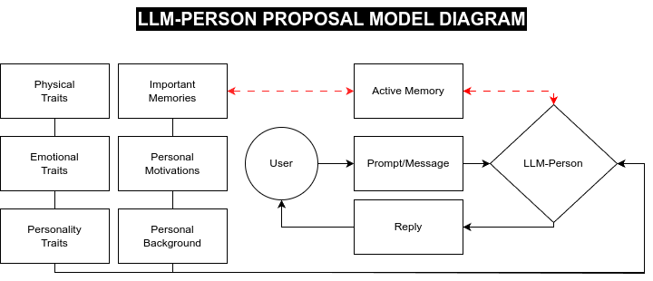

# anAI
Say hello to Ana, an AI!

To introduce you to Ana, you need to be familiar with an "llmperson". 

An llmperson is my own newly proposed model, which connects llms to features one might associate an individual person with, such as emotional and personality traits, physical appearance, motivations, background, and memories. The goal of Ana is to successfully implement this model and procedurally generate different, unique, interactable versions of Ana for each user. 

Whether Ana decides to be a platonic friend, cold adversary, neutral observer, lover, etc is currently up to random chance and how the llm is feeling, much like a real person! It is up to you to explore and get to know her, to see how things pan out. In the future there may be a selection of presets for the user to choose between or easily customize.

## Motivation
"Did you know that the first Matrix was designed to be a perfect human world? Where none suffered, where everyone would be happy. It was a disaster. No one would accept the program." - Agent Smith. 

This idea reasonates heavily with some of the goals of this project - the current AI friend and boyfriend/girlfriend apps are too friendly and robotic. Nobody is perfect, and Ana will intentionally have personality flaws designed into her to make her more relatable and realistic to the user, so that they will "accept the program". If you piss Ana off, she will hopefully remember it and require the user to repair that memory to move forward with the relationship.

## Security
Ana will run directly on your computer, powered by ollama. There will be no data collection, and all interactions will be securely contained within your own device. This is open-source software - so if you don't believe me, take a look yourself!

## Future goals
Hopefully we can get a GUI interface working on not only computers but also phones and tablets. Once generative 3d modeling and real-time frame generation is there, we could even use the physical appearance generation to create a fullly interactable, realtime 3d model! This is the end goal, until robotics takes us the rest of the way and we can get a real-life anAI!
